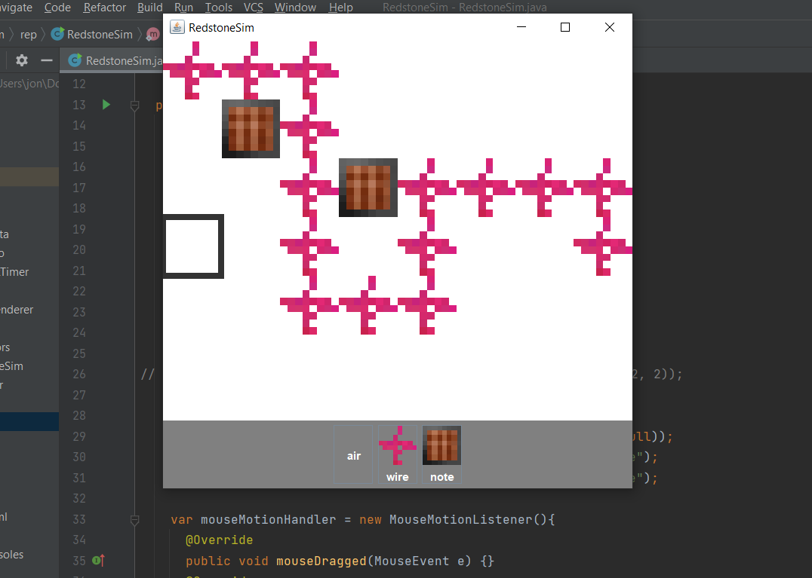

# RedstoneSim

A 2d sandbox for creating redstone-like circuits for no reason

Implemented classes:
- Chunk - efficient 2d data structure
- ChunkRenderer - renders chunks given List<BlockInfo>
- BlockData - handle raw data of a block
- BlockInfo - instructions for rendering blocks
- Neighbors - struct for storing neighbors
- Vec2 - math
- JSON - custom impl of JSON reader/writer
- AddQueue - iterate + add items + iterate added items
- ContextEx + Graphics2D + save/restore
- MouseHandler - less annoying swing mouse handler

Implemented functionality:
- Basic UI
- Coordinate transformation
- Window resizing
- Efficient voxel storage
- Voxel place/break
- Mouse hover voxel outline
- JSON.parse and JSON.stringify
- Basic Redstone propagation / powering
- Drag blocks around smoothly
- [blocks.json](./src/blocks.json) - configure your blocks!
