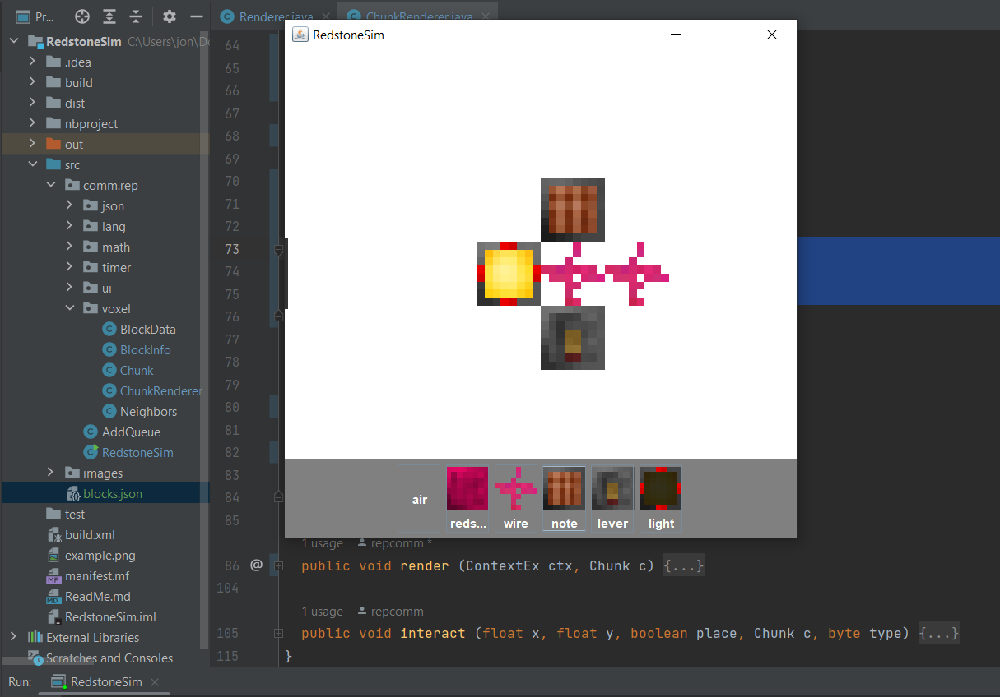

# RedstoneSim

A 2d sandbox for creating redstone-like circuits for no reason

Implemented classes:
- Chunk
- ChunkRenderer
- Vec2
- JSON

Implemented functionality:
- Basic UI
- Coordinate transformation
- Window resizing
- Efficient voxel storage
- Voxel place/break
- Mouse hover voxel outline
- JSON.parse and JSON.stringify